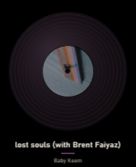
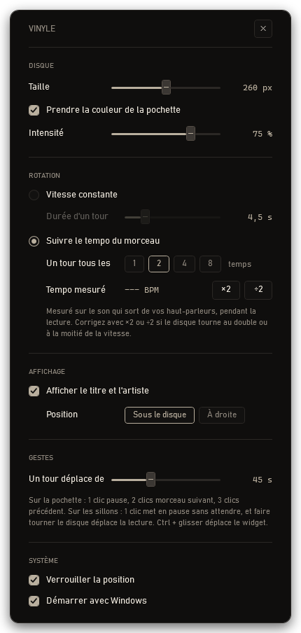

# Vinlyo

Un disque vinyle posé sur le bureau Windows. Il affiche la pochette du morceau
en cours, tourne quand la musique joue, s'arrête quand elle s'arrête, et prend
la couleur de la pochette.

Il se place au-dessus du fond d'écran mais sous toutes les fenêtres : il vit sur
le bureau sans jamais passer devant ce que vous faites.




*À gauche : le disque a pris le violet de la pochette. À droite : les réglages,
dont l'accent vient de la même pochette.*

## Ce qu'il sait faire

**Il suit ce que vous écoutez.** Titre, artiste, pochette et état de lecture
viennent de SMTC, le mécanisme de Windows qui alimente le panneau multimédia du
système. Il fonctionne donc avec Spotify, Apple Music, Chrome, et tout lecteur
qui déclare une session — sans clé d'API, sans compte, sans jeton.

**Il prend la couleur du disque.** La teinte dominante de la pochette colore le
corps du vinyle et les sillons, à valeur très basse : un vinyle teinté, pas une
assiette de couleur. La même teinte sert d'accent à la fenêtre de réglages, qui
change donc de couleur avec la musique.

**Il peut tourner au tempo.** Un détecteur de tempo écoute la sortie audio du
système en boucle interne (WASAPI loopback) et cale la durée d'un tour sur le
rythme mesuré. Réglable de un à huit temps par tour.

**Il répond aux gestes.**

| Geste | Effet |
| --- | --- |
| Clic sur la pochette | Pause |
| Deux clics sur la pochette | Morceau suivant |
| Trois clics sur la pochette | Morceau précédent |
| Clic sur les sillons | Pause, sans délai |
| Faire tourner le disque | Déplace la lecture, comme un scratch |
| Ctrl + glisser | Déplace le widget |
| Clic droit | Menu et réglages |

Distinguer un clic de deux impose d'attendre la fenêtre de double-clic du
système : la pause sur la pochette a donc environ 450 ms de latence. C'est pour
cette raison que le clic sur les sillons met en pause immédiatement.

## Ce qu'il coûte

Mesuré pendant la lecture, disque en rotation, détection de tempo active :

| | |
| --- | --- |
| Processeur | 0,6 % (Ryzen 16 cœurs) |
| Mémoire privée | 38 Mo |
| Capture audio et analyse | 0,02 % à elles seules |

Aucune scrutation : tout est piloté par les événements SMTC. La cadence de
rotation est plafonnée à 30 images par seconde, parce que la transparence par
pixel force WPF en rendu logiciel et que chaque image est composée par le
processeur.

## Construire

Nécessite le SDK .NET 8 et Windows 10 version 1809 ou plus récent.

```
dotnet publish -c Release -r win-x64 --self-contained true /p:PublishSingleFile=true
```

L'exécutable est autonome et ne demande aucune installation. Il pèse environ
180 Mo : la compression du fichier unique est volontairement désactivée, car
elle oblige le runtime à décompresser les assemblies en mémoire et triple
l'empreinte du processus. Pour un widget qui reste ouvert en permanence, la
mémoire compte plus que les mégaoctets sur disque.

Aucune dépendance NuGet. Uniquement WPF et les projections WinRT fournies par
le TFM `net8.0-windows10.0.19041.0`.

## Structure

| Fichier | Rôle |
| --- | --- |
| `MainWindow.xaml(.cs)` | Le disque, les gestes, le maintien au fond de l'ordre d'empilement |
| `SettingsWindow.xaml(.cs)` | Les réglages |
| `MediaSession.cs` | SMTC : métadonnées, état de lecture, commandes de transport |
| `AudioLoopback.cs` | Capture WASAPI de la sortie audio, en interop COM directe |
| `TempoTracker.cs` | Enveloppe d'attaque et autocorrélation, sans transformée de Fourier |
| `Palette.cs` | Couleur dominante d'une pochette |
| `Config.cs` | Réglages dans `%APPDATA%\Vinlyo\config.json` et raccourci de démarrage |

## Réglages

Ils vivent dans `%APPDATA%\Vinlyo\config.json` et se modifient par clic droit
sur le disque. Le démarrage automatique passe par un raccourci dans le dossier
Démarrage de l'utilisateur : rien n'est écrit dans le registre.

## Limites connues

Le disque reste sous toutes les fenêtres, y compris les jeux en plein écran.
Si votre bureau est toujours recouvert, vous ne le verrez qu'avec `Win`+`D`.

La détection de tempo écoute l'ensemble de la sortie audio : une notification ou
une vidéo qui joue en parallèle peut fausser la mesure le temps qu'elle dure.
L'estimation se trompe parfois d'un facteur deux, d'où les boutons ×2 et ÷2.
